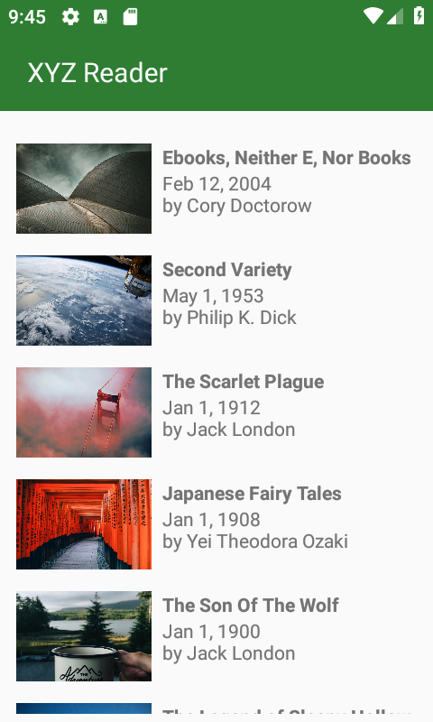
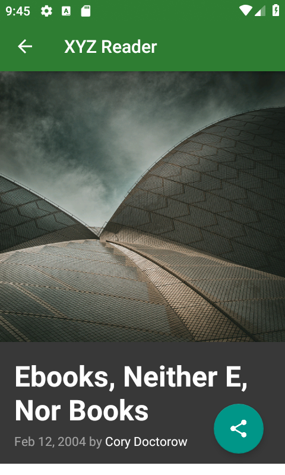
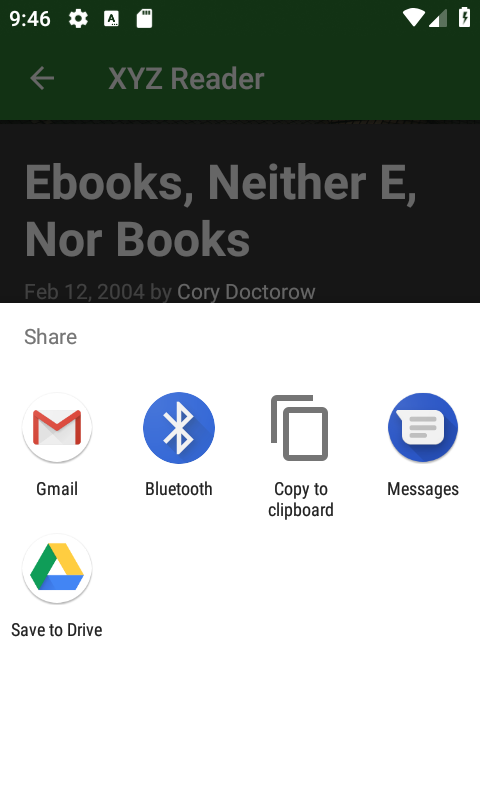

# XYZ Reader (Android App)
Android app that loads news articles from API and shows them to the user. The aim of the project was to update an old codebase to an updated version of libraries. Moreover, all the layout files were redesigned to be compatible with the material design and to work on different screens.

# Screenshots

  
  
  

